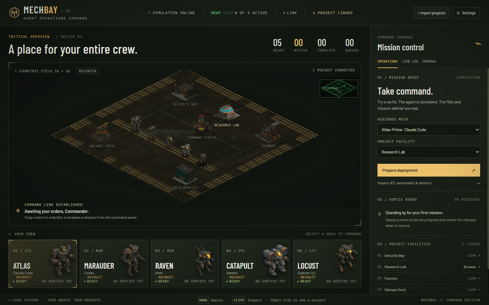
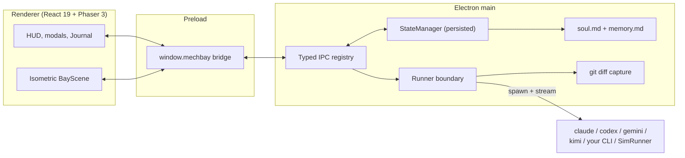

# MechBay

[](https://github.com/samalbanese/mechbay/actions/workflows/ci.yml)
[](https://github.com/samalbanese/mechbay/releases/latest)
[](LICENSE)

_A BattleTech-inspired command bay for AI coding agents._

MechBay is an Electron desktop app for deploying real coding agents as mech-class companions. Drag a mech onto an isometric facility that represents a real project directory, give it a task, and follow the live output in the command-bay HUD.

https://github.com/user-attachments/assets/c58885c0-5c88-4163-8e68-b06259d608d0

_MechBay Sortie: a 24-second trailer (with sound) cut from recordings of the real desktop app in isolated simulation mode. The agent process is scripted; the file edits and git-backed Mission Debrief are real._

## Command Edition

The bay now puts the whole crew and mission loop in view: a selectable five-mech roster, keyboard-accessible mission preparation, live fleet counts, a sortie board, project controls, and debriefs you can reopen after a mission returns. The industrial command deck pairs the original isometric world with locally bundled Barlow and IBM Plex typography.



## Download

Grab the installer for your platform from the [latest release](https://github.com/samalbanese/mechbay/releases/latest):

| Platform | File                                                                                 |
| -------- | ------------------------------------------------------------------------------------ |
| Windows  | `MechBay-<version>-setup.exe`                                                        |
| macOS    | `MechBay-<version>-arm64.dmg` (Apple Silicon) or `MechBay-<version>-x64.dmg` (Intel) |
| Linux    | `MechBay-<version>.AppImage`                                                         |

The installers are not code-signed yet, so your OS will ask once before the first launch:

- **Windows:** SmartScreen shows "Windows protected your PC". Click **More info**, then **Run anyway**.
- **macOS:** right-click MechBay in Applications, choose **Open**, then confirm. (Or allow it under System Settings, Privacy & Security.)
- **Linux:** mark the AppImage executable with `chmod +x MechBay-*.AppImage`, then run it.

Prefer to build it yourself? The next section runs it from source.

## Try it in 60 seconds (no API keys)

You don't need any agent CLI installed to feel the loop:

```bash
git clone https://github.com/samalbanese/mechbay.git
cd mechbay
npm install
npm run demo
```

Demo mode boots the bay with a built-in simulation runtime behind every mech. Drag any mech onto the seeded `reactor-control` facility: it walks over, streams a scripted mission log in that mech's voice, edits real files in a real git-initialized workspace, and returns with a Mission Debrief showing a genuine diff. Nothing downstream of the runner is mocked; demo mode swaps only the agent process itself. Your real bay state is untouched (demo persists to a separate store), and the HUD reads `SIMULATION ONLINE` so there's no confusion about which world you're in.

Have a real agent CLI installed? `npm run dev` and deploy for real.

## What it does

- Deploys real local agent processes into real project directories.
- Maps five named mechs to Claude Code, Codex, Kimi on Fireworks AI, Gemini CLI, or any command-line agent you bring yourself. The author runs Claude Code and Codex and checks them before every release; the others are wired the same way but not verified by the author.
- Streams live output to the HUD; Raven can also show opt-in `INTENT` and `FINDINGS` thought cards.
- Runs up to three deployments at once. Missions you send while every slot is busy wait in line and start in the order you sent them.
- Lets you cancel a waiting mission or recall a running one at any time. Recall ends the agent and every program it started, and closing MechBay does the same for every mission.
- Lets you choose how much each mech may do: Read only, Edit files, or Full. Claude Code and Codex enforce the level through their own permission flags; a level a runtime cannot enforce is shown disabled, never faked.
- Captures a Mission Debrief after every run: changed files, insertions, deletions, and a built-in diff viewer. Click any changed file to read the exact lines the agent added and removed, new files included.
- Renders a living bay: a hangar deck with hazard-striped landing pads, power conduits pulsing data between linked facilities, a radar sweep from the command center, drifting haze, sweeping searchlights, and a clickable minimap. Scroll to zoom, drag empty ground or the minimap to pan, and hit **RECENTER** to snap back.
- Moves like an RTS: each mech walks with its own gait (the Atlas stomps and shakes the camera, the Locust skitters), with footfall dust, landing squash, and contact shadows. Hover and selection glows, unit plates with callsign, rank, and live status, and markers for mechs awaiting input or queued all come from real state.
- Plays deploy cinematics: drop-target lock-on while you drag, a target reticle and marching route line for the walk, a hologram ring, weld sparks, and a data link while the mech works, a light pillar and shockwave when it succeeds, and an explosion and a smoking hull when it goes down.
- Talks back: each mech radios short, in-character acknowledgements with its portrait as missions launch, land, need input, finish, or fail, and a cockpit computer calls out lance-wide events in MechWarrior-style green. A compass tape follows the selected mech's heading, a heat gauge shows how full the lance is, the minimap doubles as a radar, and crew cards flip to wireframe schematics on hover.
- Makes its own sound: every interface click, radio chirp, footstep, and alarm is synthesized at runtime, panned to where it happens on the field. Toggle sound and set the volume in **⚙ SETTINGS**.
- Keeps a service record for every mech. Sorties, success rate, and lines shipped earn XP, and pilots climb six ranks from Recruit to Ace, shown as insignia and an XP bar on each crew card.
- Sends mission alerts while you're in another window: a desktop notification, a taskbar flash, and a working indicator on the taskbar icon. Toggle them in **⚙ SETTINGS**.
- Keeps each mech's `soul.md` and `memory.md` between deployments, with an in-app Journal for editing both.
- Handles the rough edges: dead-in-field failure states, click-to-recover, and a crash-recovery modal on the next launch.
- Lets you browse facility files read-only through a whitelist guard, bulk import projects, click an empty bay tile to add a facility from a directory picker, or click an unlinked starter building to connect it to a project directory.
- Lets you rename mechs and optionally store runtime API keys encrypted by the OS; keys are injected only into that mech's process when a deployment launches.

## The mechs

| Mech           | Class role        | Runtime               | Requirements                                                                                                        |
| -------------- | ----------------- | --------------------- | ------------------------------------------------------------------------------------------------------------------- |
| Atlas-Prime    | Heavy assault     | Claude Code           | `claude` on `PATH`                                                                                                  |
| Marauder-Prime | Surgical strike   | Codex                 | `codex` on `PATH`                                                                                                   |
| Raven-Prime    | Recon scout       | Kimi via Fireworks AI | `python` on `PATH` and a stored or environment `FIREWORKS_API_KEY`. Bring your own key, not verified by the author. |
| Catapult-Prime | Ranged multimodal | Gemini CLI            | `gemini` on `PATH`. Bring your own key, not verified by the author.                                                 |
| Locust-Prime   | Swarm courier     | Bring your own agent  | `MECHBAY_HERMES_CMD` set to a CLI command line. Not verified by the author.                                         |

An unconfigured mech shows `⚠ NOT DEPLOYABLE`. The rest of the bay remains usable.

_The author runs Claude Code and Codex with MechBay and checks them before every release. Kimi, Gemini, and bring-your-own agents are not verified by the author. Any runtime that is not set up shows NOT DEPLOYABLE instead of failing._

## Any mech, any runtime (bring your own key)

Every mech's runtime is reassignable from the UI, so you're not stuck with the family it launched with. Select a mech, open its panel, and the **RUNTIME** section lets you:

- Pick any of the five runtimes from a dropdown (the mech's native family is marked `· DEFAULT`).
- Set an optional model override, passed straight through to that runtime's CLI:

| Runtime          | Model flag                                    |
| ---------------- | --------------------------------------------- |
| Claude Code      | `--model`                                     |
| Codex            | `-m`                                          |
| Gemini CLI       | `-m`                                          |
| Kimi (Fireworks) | `--model`                                     |
| Custom CLI       | `{MODEL}` placeholder in `MECHBAY_HERMES_CMD` |

Press **APPLY** and MechBay re-probes availability for the new runtime immediately; the availability badge updates without a restart.

Open **⚙ SETTINGS** to rename mechs and manage runtime credentials. Claude Code
continues to use its own login. For Codex, Gemini, Kimi, and custom runtimes,
MechBay can store a key encrypted by Electron's OS-backed `safeStorage`
(Windows DPAPI on Windows) and inject it only into that mech's process at
launch. Keys are never written in plain text or exposed back to the renderer.
Stored keys are optional: existing environment variables keep working when no
stored key exists. When both are present, the stored key wins because it is the
explicit in-app choice.

## Quickstart (real agents)

Requirements: Node.js 22+, npm, and git on `PATH` (git powers Mission Debrief). MechBay runs on Windows, macOS, and Linux; it is developed on Windows. Install at least one runtime from the table above.

```bash
git clone https://github.com/samalbanese/mechbay.git
cd mechbay
npm install
npm run dev
```

## How it's built



One `Runner` interface is the entire boundary between MechBay and the outside world. Claude Code, Codex, Gemini, Kimi, a bring-your-own CLI, and the demo-mode simulator are each a drop-in implementation of it. Everything crossing the Electron IPC boundary is a serializable type declared in one shared registry, and every channel name lives in a single constants file. Unit and integration tests cover the runners, the IPC layer, state, and the bay's pure helpers. CI type-checks the app and the tests, lints, runs the tests on Windows and Linux, and builds the app on every pull request, and the same checks gate every release.

## Status

**Command Edition: a complete deployment and review experience, built on the v1.3 runtime architecture.**

## Configuring runtimes

MechBay checks runtime availability at startup. Install each CLI and make sure
its command is available on `PATH` before launching the app. Authenticate with
the runtime's own login, an environment variable, or an encrypted key saved in
**⚙ SETTINGS** where supported.

- **Atlas-Prime / Claude Code:** install Claude Code so `claude` runs from a terminal.
- **Marauder-Prime / Codex:** install the Codex CLI so `codex` runs from a terminal.
- **Catapult-Prime / Gemini:** install Gemini CLI so `gemini` runs from a terminal.
- **Raven-Prime / Kimi:** MechBay runs the bundled `scripts/kimi_fireworks.py` wrapper. It needs `python` on `PATH` and a Fireworks key. The wrapper gives Kimi a full agentic tool loop, and MechBay enables its `--narrate` mode automatically so Raven's `▸ INTENT` and `◆ FINDINGS` thought cards stream into the live log.
- **Locust-Prime / bring your own agent:** set `MECHBAY_HERMES_CMD` to any CLI command line. If it contains `{PROMPT}`, MechBay substitutes the task there. Otherwise it pipes the task prompt to the command's standard input. If the command line also contains `{MODEL}`, MechBay substitutes the model override there when one is set; if no override is set, the `{MODEL}` token is dropped cleanly (and if the command line has no `{MODEL}` placeholder at all, any model override is simply ignored).

For example, in PowerShell before starting MechBay:

```powershell
$env:FIREWORKS_API_KEY = "your-fireworks-key"
$env:MECHBAY_HERMES_CMD = "aider"
# Or let the command receive the task as an argument:
$env:MECHBAY_HERMES_CMD = "opencode {PROMPT}"
```

`aider`, `goose`, `opencode`, and your own scripts can all work as Locust runtimes if they accept either standard input or a substituted `{PROMPT}` argument.

## Mission Debrief, souls, and memory

When a mech returns, MechBay runs a git diff in that facility and opens a **MISSION DEBRIEF** modal with file-level change stats. Select any file in the delta table to open its patch inline: added and removed lines with old and new line numbers, including files the agent created from scratch. A check-mark speech bubble appears over the returning mech, and the outcome is written to that mech's `memory.md` and counted toward its service record.

The diff viewer only reads files the mission itself reported as changed, and it refuses paths that escape the project, including through symlinks.

Each companion also has a `soul.md`: its persona and working voice. Both files are included in the next deployment's context. Use the Journal tab to read or edit them without leaving the app.

## Project structure

```
src/
  main/              Electron process, IPC handlers, persistence, runners, and filesystem access
    runners/         Shared runner base plus Claude, Codex, Kimi, Gemini, and BYO-agent runtimes
  preload/           Safe window.mechbay bridge between Electron and the renderer
  renderer/
    src/             React command-bay UI, Phaser scene, HUD, modals, Journal, and File Browser
  shared/            Serializable types, defaults, IDs, and the single IPC channel registry
test/
  unit/              Unit coverage for runners, state, log narration, filesystem access, and UI helpers
  integration/       Deployment lifecycle coverage
assets/              Mech and facility sprites
scripts/             Kimi Fireworks wrapper and chromakey utility
docs/                Demo gif and screenshots
```

## Development

```bash
npm run dev          # start Electron with hot reload
npm run demo         # start in demo mode: every mech deployable, no API keys
npm run capture:demo # record docs/demo.gif automatically (Playwright + ffmpeg)
npm run capture:portfolio # build, verify the mission loop, capture screenshots, and refresh all project media
npm run typecheck    # type-check main and renderer code
npm test             # run the Vitest suite
npm run test:watch   # run Vitest in watch mode
npm run build        # type-check and build to out/
npm run build:win    # build a Windows installer
npm run build:mac    # build a macOS package
npm run build:linux  # build a Linux package
npm run chromakey    # process mech and facility sprites
```

### Cutting a release

Pushing a version tag builds Windows, macOS, and Linux installers on GitHub Actions and attaches them to a **draft** release for review:

```bash
npm version minor    # bumps package.json and creates the vX.Y.0 tag
git push origin main --follow-tags
```

Open the draft on the Releases page, check the notes and files, then click **Publish release**.

## License

MIT. See [LICENSE](LICENSE).

MechBay is a fan-inspired project and is not affiliated with, endorsed by, or connected to Topps, Catalyst Game Labs, or the BattleTech franchise. All mech and facility art is original, AI-generated work.

## Why

I wanted my AI agents to feel like companions, not buttons.
